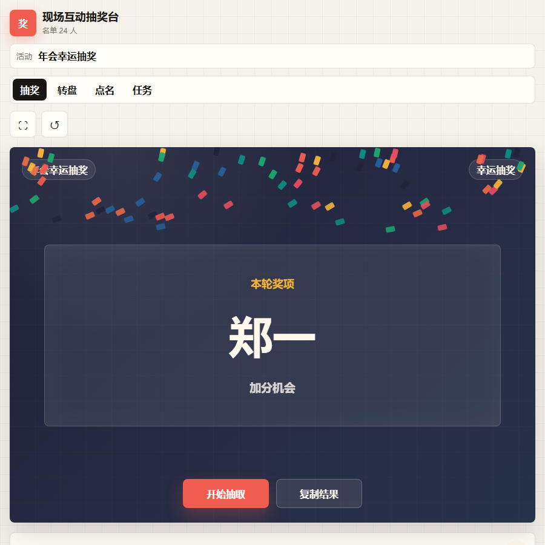
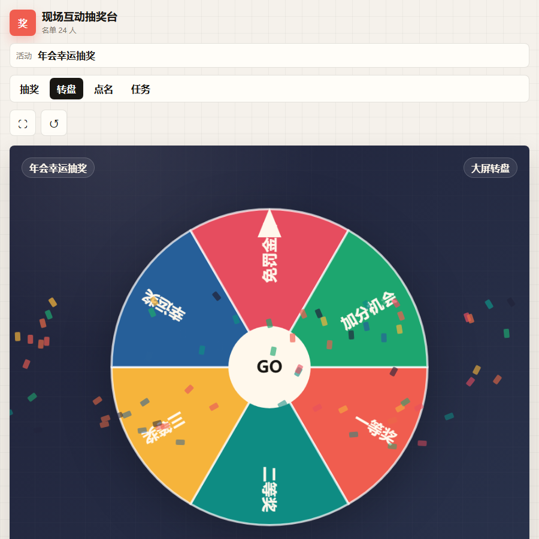
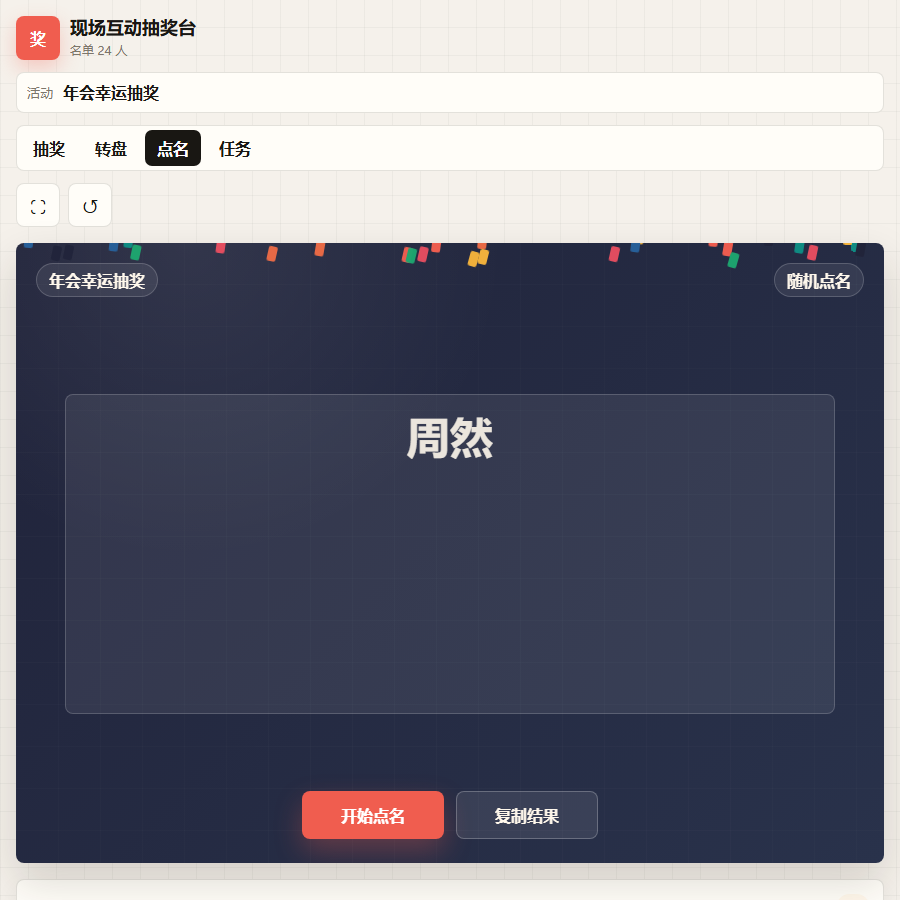
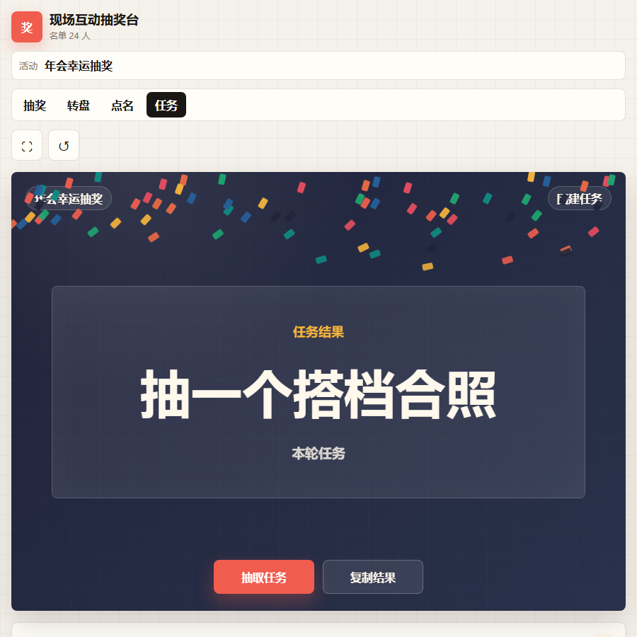

# Event Interaction Kit

现场互动抽奖台是一个纯前端 H5 工具，用于年会、团建、婚礼、班级活动、门店活动和直播间互动。它不需要后端服务，下载后直接打开 `index.html` 就能使用。

## Features

- 名单抽奖
- 大屏转盘
- 随机点名
- 团建任务/奖励/惩罚库
- 自定义活动名称、名单、奖项和主题色
- 本地保存配置和结果记录
- 结果复制
- 电脑投屏和手机浏览器都可用

## Quick Start

直接下载仓库，双击打开 `index.html`。

也可以放到任意静态网站服务里运行，例如 GitHub Pages、Netlify、Vercel 或普通 Web 服务器。

## Screenshots

## Customization

打开页面后，可以直接在右侧编辑：

- 活动名称
- 抽奖名单
- 奖项/转盘项
- 团建任务
- 主题色

这些配置会保存在当前浏览器本地。

## Use Cases

- 公司年会抽奖
- 团建破冰互动
- 婚礼暖场游戏
- 班级随机点名
- 门店活动抽奖
- 直播间互动

## Notes

这是活动互动展示工具，不包含现金博彩、支付、用户账户或服务端数据收集能力。

## License

MIT
